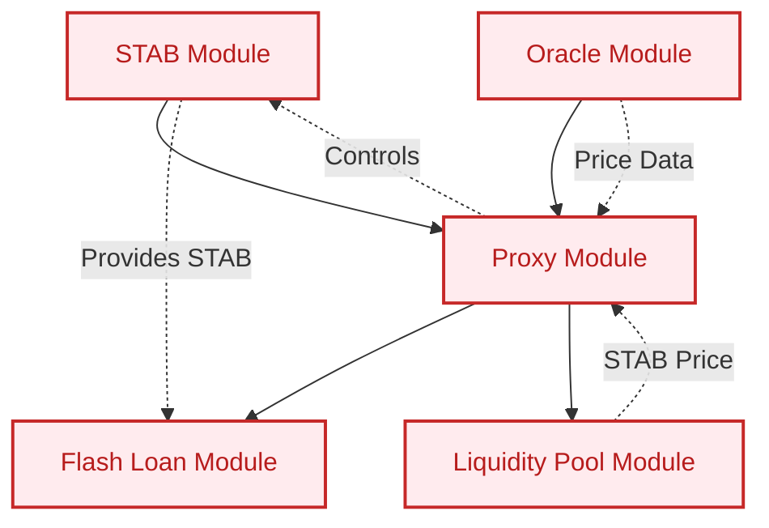
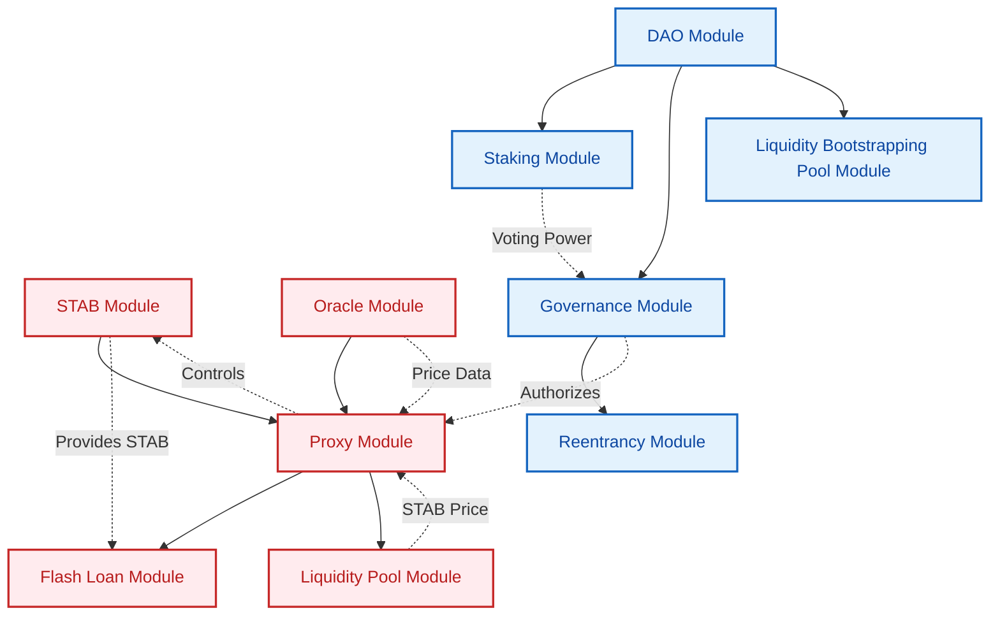

# STAB Protocol - Enabling Radix-native Stability

The STAB protocol is a decentralized system for creating and managing a stablecoin called STAB. It should ideally be governed by a DAO, but can also be used by a centralized administrator.

### Components
The STAB Protocol consists of several key components:

1. **Stabilis Component**: The core component that manages STAB token creation, loan operations, and liquidations. Users can open collateralized debt positions (CDPs) to borrow STAB tokens against accepted collateral.

2. **Proxy Component**: Acts as an intermediary for all interactions with the Stabilis component. It updates parameters like interest rates and collateral prices, ensures authorized access, and facilitates potential upgrades.

3. **Flash Loans Component**: Allows users to borrow STAB tokens for use within a single transaction.

4. **Stabilis Liquidity Pool**: A native STAB/XRD liquidity pool used to determine the price of STAB tokens.

5. **Oracle Component**: Aggregates external price data for use by the Proxy component.

### Key features of the STAB module include:

- Loan management (open, close, top up, borrow more, partial close)
- Liquidation process (marking, liquidating, retrieving leftover collateral)
- Interest rate adjustment using a PID controller to maintain the STAB peg
- Collateral price updates from oracles

### Whitepaper
For a more extensive overview of the STAB Protocol's working, read the [preliminary whitepaper](https://github.com/Stabilis-Labs/STAB-Protocol/blob/main/docs/stab_protocol_whitepaper.pdf).

## Deploying the STAB Protocol

To deploy the STAB module, follow these steps:

1. Instantiate the STAB module.
2. Instantiate the Oracle module.
3. Instantiate the Proxy module using the STAB module and the Oracle module.
4. The Proxy module automatically instantiates the Flash Loan module.
5. The Proxy module automatically instantiates the Liquidity Pool module (STAB/XRD pool).

After these steps, the STAB Protocol will be fully deployed. Here's a diagram representing the STAB Protocol's components and their interactions:

## Connecting the STAB Protocol to a DAO

Once the STAB Protocol is deployed, it should ideally be governed by a DAO. To this end, the [DAOpensource package](https://github.com/Stabilis-Labs/DAOpensource) can be used.

Once properly set up, here's a complete diagram showing both modules and their connections:

## Disclaimer

This package is made for research purposes only. In production use of this package is discouraged. Stabilis Labs is not responsible for or affiliated with any deployments of this package.
